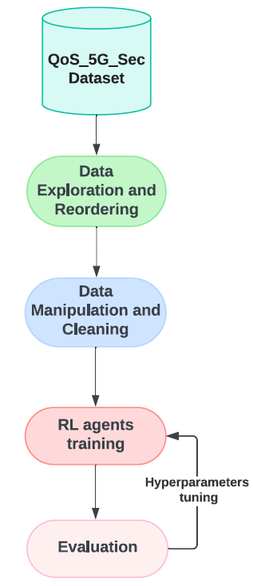
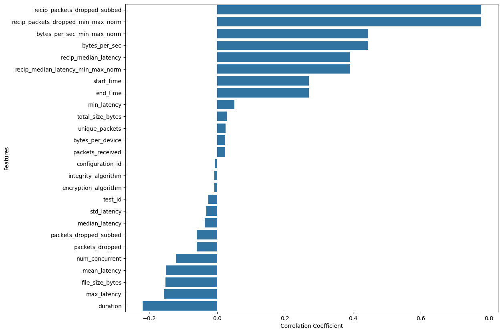
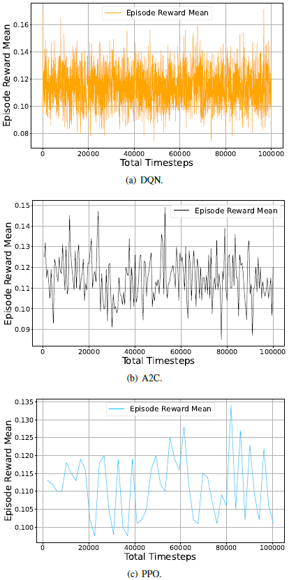
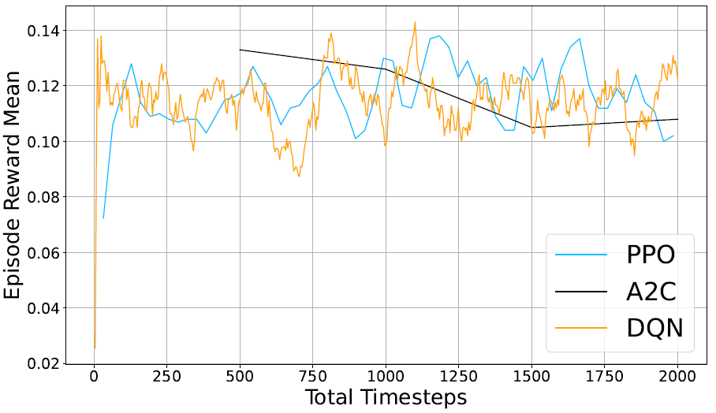

# Altering 5G Network Parameters using Deep Reinforcement Learning to Optimize QoS and Security

<a href="#"></a>
<a href="#"></a>
<a href="#"></a>
<a href="#"></a>
<a href="#"></a>
<a href="#"></a>
<a href="#"></a>
<a href="#"></a>
<a href="#"></a>
<a href="#"></a>

---

##  Project Highlights

- Proposed a Deep Reinforcement Learning framework to balance **Quality of Service (QoS)** and **security** in 5G networks
- Generated a custom **QoS_5G_Sec** dataset from simulated 5G experiments with multiple security configurations
- Evaluated three RL agents: **DQN**, **PPO**, and **A2C**
- Applied four hyperparameter tuning methods: **Optuna**, **Random Search**, **Parameter Grid**, and **HyperOpt**
- Found that **DQN tuned with Optuna** achieved the best overall performance on this dataset

---

## Abstract

As 5G networks continue to expand, the challenge of balancing Quality of Service (QoS) and security becomes increasingly important. Improving security settings can negatively affect throughput and latency, while prioritizing QoS may expose the network to greater risks.

This project presents a Deep Reinforcement Learning (DRL)-based framework for dynamically adjusting 5G network parameters to optimize the trade-off between QoS and security. Using a generated dataset named **QoS_5G_Sec**, we evaluate **Deep Q-Network (DQN)**, **Proximal Policy Optimization (PPO)**, and **Advantage Actor-Critic (A2C)**. We further study the effect of multiple hyperparameter tuning strategies, including **Optuna**, **Random Search**, **Parameter Grid**, and **HyperOpt**.

Results show that **DQN tuned with Optuna** provides the best overall performance, offering a promising approach for adaptive and intelligent 5G network parameter control.

---

##  Key Contributions

- Generated a 5G-focused dataset to study the trade-off between **QoS and security**
- Designed an RL environment where agents dynamically select parameter configurations in real time
- Compared **DQN**, **PPO**, and **A2C** under both untuned and tuned settings
- Evaluated four hyperparameter optimization techniques across all agents
- Demonstrated that **DQN + Optuna** is the strongest overall solution for this task

---

## Dataset: QoS_5G_Sec

To build the dataset, two simulated 5G networks were set up using:

- **8 Raspberry Pi 4 devices** per network
- **2 Intel NUC 12 Pro units** per network
- One NUC acting as the **radio tower**
- One NUC acting as the **5G core**
- Seven Raspberry Pis acting as **user equipment**
- One Raspberry Pi acting as the **file server**

### Experimental setup
- **15 different security configurations**
- **18 distinct files** transferred per configuration
- File types included: `csv`, `doc`, `jpg`, `mp3`, `mp4`, `pdf`, `txt`, `xls`, and `zip`
- Tests executed with increasing numbers of concurrent users
- Security algorithms included **Snow 3G**, **AES**, and **ZUC**

### QoS score
The target QoS score was computed from the average of:

- `recip_median_latency_min_max_norm`
- `recip_packets_dropped_min_max_norm`
- `bytes_per_sec_min_max_norm`

---

## System Model

The framework consists of five main stages:

1. **QoS_5G_Sec dataset generation**
2. **Data exploration and reordering**
3. **Data manipulation and cleaning**
4. **RL agents training**
5. **Evaluation + hyperparameter tuning**

<p align="center">
  
  <br>
  <b>Figure 1:</b> System model architecture.
</p>

---

## Data Exploration and Preprocessing

The dataset contains **30 features** and focuses on how QoS varies under different security configurations.

### Main preprocessing steps
- Exploratory Data Analysis (EDA)
- Label encoding of categorical features such as:
  - `integrity_algorithm`
  - `encryption_algorithm`
- Data filtering, grouping, scoring, and labeling
- Correlation analysis between input features and QoS

<p align="center">
  
  <br>
  <b>Figure 2:</b> Feature correlation with QoS.
</p>

---

## Reinforcement Learning Setup

Three RL agents were evaluated:

- **DQN**
- **PPO**
- **A2C**

### Environment design
- **State:**  
  - integrity algorithm  
  - encryption algorithm  
  - number of concurrent users  

- **Action space:**  
  Discrete space with **8 actions** representing possible parameter configurations

- **Reward:**  
  QoS value returned by the environment

- **Training:**  
  - `100,000` episodes
  - `MlpPolicy`

---

## Hyperparameter Tuning

We evaluated four tuning strategies:

- **Optuna**
- **Random Search**
- **Parameter Grid**
- **HyperOpt**

### Tuned parameters
- Learning rate
- Buffer size
- Batch size
- Tau
- Learning starts

---

## Results

### RL agents before tuning

<p align="center">
  
  <br>
  <b>Figure 3:</b> Feature correlation with QoS.
</p>


### Best tuning strategy per agent

- **DQN → Optuna**
- **A2C → Random Search**
- **PPO → Parameter Grid**

---

##  DQN Hyperparameter Tuning Results

| Metric | No Tune | HyperOpt | Param Grid | Optuna | Random Search |
|---|---:|---:|---:|---:|---:|
| Avg Ep Reward Mean | 0.1077 | 0.1155 | 0.1165 | **0.1320** | 0.0932 |
| Std Dev of Reward | 0.1106 | 0.1043 | 0.1427 | **0.1016** | 0.1299 |
| Avg Reward | 0.1102 | 0.1056 | 0.0901 | **0.1210** | 0.0923 |
| Convergence Time (episodes) | 1.0 | 1.0 | 1.0 | 1.0 | 1.0 |
| FPS | 1187.72 | 1386.49 | 1833.41 | 1355.41 | **1836.03** |

---

## 📊 A2C Hyperparameter Tuning Results

| Metric | No Tune | HyperOpt | Param Grid | Optuna | Random Search |
|---|---:|---:|---:|---:|---:|
| Avg Ep Reward Mean | 0.1059 | 0.1068 | 0.0960 | 0.1002 | **0.1098** |
| Std Dev of Reward | 0.1166 | **0.0986** | 0.1130 | 0.1488 | 0.1189 |
| Avg Reward | 0.1025 | 0.1145 | 0.1023 | 0.1113 | **0.1186** |
| Convergence Time (episodes) | 1.0 | 1.0 | 1.0 | 1.0 | 1.0 |
| FPS | 533.475 | N/A | **1442.6** | 1291 | 997.6 |

---

##  PPO Hyperparameter Tuning Results

| Metric | No Tune | HyperOpt | Param Grid | Optuna | Random Search |
|---|---:|---:|---:|---:|---:|
| Avg Ep Reward Mean | 0.1005 | 0.0964 | **0.1021** | 0.1019 | 0.1013 |
| Std Dev of Reward | 0.1497 | 0.1189 | 0.1104 | 0.1183 | **0.0986** |
| Avg Reward | 0.1104 | 0.1185 | **0.1132** | 0.1032 | 0.1094 |
| Convergence Time (episodes) | 1.0 | 1.0 | 1.0 | 1.0 | 1.0 |
| FPS | 1164.36 | **1239.30** | 838.37 | 910.15 | 837.21 |

---

##  Final Optimized Agent Comparison

| Metric | A2C (Random Search) | PPO (Parameter Grid) | DQN (Optuna) |
|---|---:|---:|---:|
| Avg Ep Reward Mean | 0.1098 | 0.1121 | **0.1320** |
| Std Dev of Reward | 0.1189 | 0.1104 | **0.1016** |
| Avg Reward | 0.1186 | 0.1132 | **0.1210** |
| Convergence Time (episodes) | 1.0 | 1.0 | 1.0 |
| FPS | 997.6 | 838.37 | **1355.41** |

### Key Insight
**DQN tuned with Optuna** achieved the strongest overall balance across:
- reward
- stability
- efficiency

<p align="center">
  
  <br>
  <b>Figure 4:</b> RL agents episode reward over mean comparison for the first 2000 episodes.
</p>
<!-- <p align="center">
  
  <br>
  <b>Figure 4:</b> RL agents episode reward mean comparison for the first 2000 episodes.
</p> -->

---

## Additional Exploration

We also explored recurrent approaches:
- **Recurrent PPO**
- **Recurrent Q-Network**
- **LSTM for A2C**

Although these methods were intended to leverage historical episode information, they did **not improve performance** in this study, so the final framework retained the original methods.

---

##  Why This Matters

5G systems must support high performance while maintaining strong security guarantees. These goals often conflict in practice. This project shows that Deep Reinforcement Learning can help dynamically adapt network configurations to balance QoS and security in real time, making it highly relevant for:

- intelligent telecom systems
- adaptive cybersecurity
- AI-driven network optimization
- future 5G / 6G management frameworks

---

## Citation

```bibtex
@inproceedings{Kaddour_5G_DRL_QoS_Security,
  author    = {Hamza Kaddour and Israel G. Olaveson and Cameron J. Krome and Mostafa M. Fouda},
  title     = {Altering 5G Network Parameters using Deep Reinforcement Learning to Optimize QoS and Security},
  booktitle = {2024 IEEE Virtual Conference on Communications (VCC)},
  year      = {2024}
}
